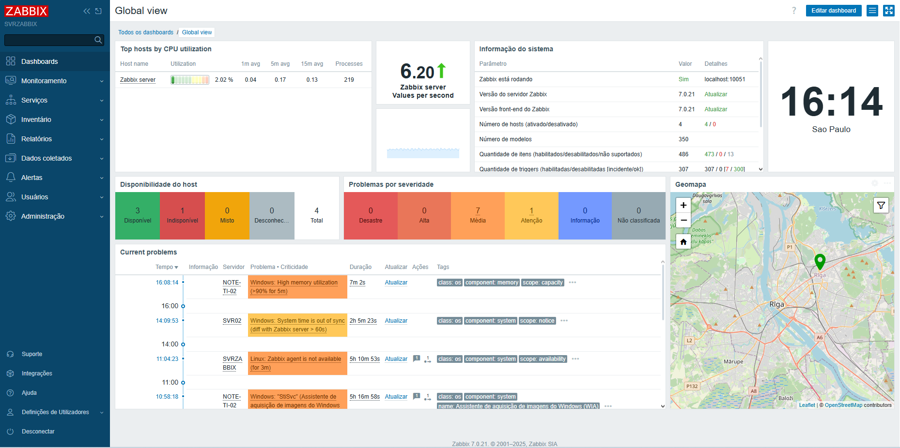
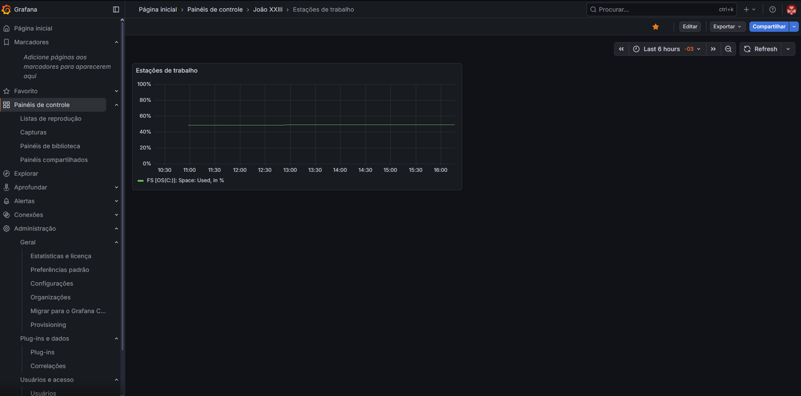

# monitoring-lab-zabbix-grafana-
Lab de monitoramento com Zabbix + Grafana, MariaDB e integração com AD/LDAP.

# Lab de Monitoramento – Zabbix + Grafana

Projeto de laboratório para implantação de um ambiente completo de monitoramento
utilizando **Zabbix Server 7.x**, **Grafana** e **MariaDB/MySQL**, rodando em servidor
Linux (Ubuntu) virtualizado.

## Objetivos

- Configurar Zabbix Server com banco dedicado e agente local.
- Monitorar hosts Linux e Windows (inclusive controlador de domínio).
- Integrar Zabbix com Grafana via API para criação de dashboards.
- Iniciar integração de autenticação com Active Directory/LDAP.

## Tecnologias

- Ubuntu Server 22.04
- Zabbix Server 7.x + Zabbix Agent
- MariaDB/MySQL
- Grafana
- Active Directory / LDAP (em progresso)

## Documentação

Toda a documentação detalhada está na pasta [`docs/`](docs/):

- [Arquitetura do ambiente](docs/arquitetura.md)
- [Instalação e configuração do Zabbix](docs/instalacao-zabbix.md)
- [Configuração do banco de dados](docs/banco-de-dados.md)
- [Integração com Grafana](docs/instalacao-grafana.md)
- [Integração com LDAP/Active Directory](docs/ldap-ad.md)
- [Próximos passos e melhorias](docs/proximos-passos.md)

## Status

- ✅ Zabbix Server instalado e operando
- ✅ Agentes configurados (servidor e host Windows)
- ✅ Grafana integrado ao Zabbix
- 🔧 LDAP/AD em configuração
- 🔧 Dashboards adicionais em construção

