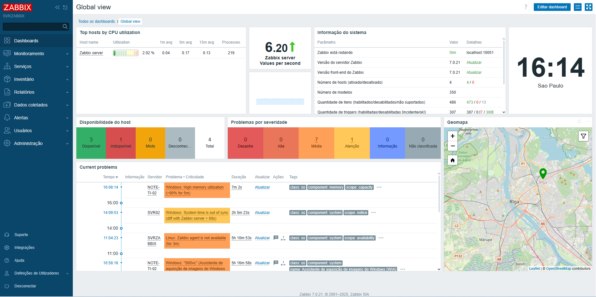
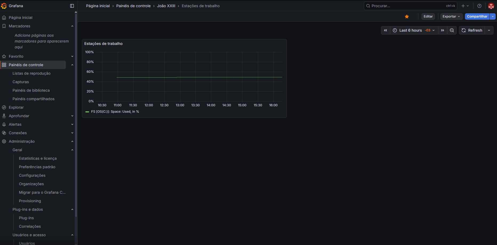

# Monitoring Lab · Zabbix + Grafana + LDAP/AD


Laboratório técnico de monitoramento com **Zabbix**, **Grafana**, **MariaDB** e trilha de integração com **LDAP / Active Directory**, estruturado para **estudo prático**, **documentação reproduzível** e **apresentação de portfólio** com padrão mais próximo de ambiente corporativo.

---

## Executive Summary

Este projeto consolida a implantação e documentação de um ambiente de monitoramento centralizado em laboratório, com foco em:

- monitoramento de hosts Linux e Windows com **Zabbix Agent**;
- visualização operacional e executiva com **Grafana**;
- persistência em **MariaDB**;
- preparação de autenticação corporativa com **LDAP / Active Directory**;
- organização documental adequada para estudo, evolução técnica e uso como vitrine profissional.

O repositório foi desenhado para ser útil tanto para quem deseja **aprender a pilha** quanto para quem precisa **demonstrar capacidade de documentação, automação e desenho de ambiente**.

---

## Features

- Implantação base do **Zabbix Server 7.x** em **Ubuntu Server 22.04**
- Frontend web do Zabbix documentado e acessível para operação do lab
- **Grafana** integrado como camada de visualização complementar
- Banco de dados **MariaDB/MySQL** configurado para o ambiente
- Monitoramento de hosts **Linux** e **Windows** via agentes
- Trilha de integração com **LDAP / AD** para autenticação centralizada
- Scripts iniciais de automação para servidor Linux e agente Windows
- Documentação separada por domínio técnico
- Estrutura organizada para evolução futura em prova de conceito

---

## Business / Technical Value

Este lab demonstra competências relevantes para cenários de infraestrutura e observabilidade:

- instalação e troubleshooting de serviços centrais;
- organização de ambiente de monitoramento com múltiplas camadas;
- integração entre coleta, persistência e visualização;
- preocupação com autenticação centralizada e governança de acesso;
- capacidade de transformar prática técnica em documentação reutilizável.

---

## Architecture Overview

```text
[ Usuário / Operação ]
        |
        | HTTP 80                        HTTP 3000
        |---------------------.     .---------------------->
        |                     |     |                        [ Grafana ]
        |                     v     |                              |
        |              [ Zabbix Frontend ]                        |
        |                     |                                   |
        |                     | API / PHP                         | Data source / plugin
        |                     v                                   v
        |               [ Zabbix Server ] -----------------> [ Zabbix API ]
        |                     |
        |                     | TCP 3306
        |                     v
        |                 [ MariaDB ]
        |
        | TCP 10050 / 10051 / LDAP(S)
        v
[ Hosts Linux ] [ Hosts Windows ] [ Active Directory / LDAP ]
```

A visão arquitetural expandida está em [`docs/arquitetura.md`](docs/arquitetura.md).

---

## Stack

- **Ubuntu Server 22.04**
- **Zabbix Server 7.x**
- **Zabbix Agent**
- **Grafana**
- **MariaDB / MySQL**
- **Apache + PHP**
- **Active Directory / LDAP**
- **VirtualBox**
- **PowerShell** e **Bash**

---

## Repository Structure

```text
monitoring-lab-zabbix-grafana/
├── README.md
├── CHANGELOG.md
├── docs/
│   ├── arquitetura.md
│   ├── banco-de-dados.md
│   ├── como-reproduzir-lab.md
│   ├── instalacao-grafana.md
│   ├── instalacao-zabbix.md
│   ├── ldap-ad.md
│   └── proximos-passos.md
├── images/
│   ├── dashboard-global-view.png
│   └── grafana-dashboard.png
└── scripts/
    ├── install_zabbix_agent_windows.ps1
    └── install_zabbix_server_ubuntu.sh
```

---

## Documentation Map

- [`docs/arquitetura.md`](docs/arquitetura.md) — topologia lógica, fluxos e papéis dos componentes
- [`docs/instalacao-zabbix.md`](docs/instalacao-zabbix.md) — instalação do servidor Zabbix, frontend e agent no Ubuntu
- [`docs/banco-de-dados.md`](docs/banco-de-dados.md) — criação e preparação do banco do Zabbix
- [`docs/instalacao-grafana.md`](docs/instalacao-grafana.md) — instalação do Grafana e integração com o Zabbix
- [`docs/ldap-ad.md`](docs/ldap-ad.md) — trilha de autenticação LDAP / Active Directory
- [`docs/como-reproduzir-lab.md`](docs/como-reproduzir-lab.md) — roteiro resumido para recriação do laboratório
- [`docs/proximos-passos.md`](docs/proximos-passos.md) — backlog técnico e evolução planejada
- [`CHANGELOG.md`](CHANGELOG.md) — histórico de evolução documental e técnica do projeto

---

## Quick Start

1. Crie uma VM com **Ubuntu Server 22.04**.
2. Revise o script `scripts/install_zabbix_server_ubuntu.sh`.
3. Substitua placeholders de senha e parâmetros do ambiente.
4. Execute a instalação base do servidor.
5. Configure acesso ao frontend do Zabbix.
6. Instale o agente nos hosts monitorados.
7. Integre o Grafana ao Zabbix.
8. Opcionalmente, avance para autenticação via LDAP / AD.

Guia resumido: [`docs/como-reproduzir-lab.md`](docs/como-reproduzir-lab.md)

---

## Screenshots

### Zabbix · visão global do ambiente



### Grafana · dashboard de visualização



> Recomendação: em uma próxima iteração, incluir capturas adicionais de hosts, problemas, itens, integração LDAP e visão de alertas.

---

## Scripts Included

### `scripts/install_zabbix_server_ubuntu.sh`
Instalação base do lab em Ubuntu 22.04.

Escopo atual:
- atualização do sistema;
- instalação de dependências;
- instalação do MariaDB;
- criação da base do Zabbix;
- instalação do Zabbix Server, frontend e agent;
- instalação do Grafana.

### `scripts/install_zabbix_agent_windows.ps1`
Instalação silenciosa do Zabbix Agent em hosts Windows.

Escopo atual:
- validação de MSI local;
- instalação com `msiexec`;
- configuração inicial de `SERVER`, `SERVERACTIVE` e `HOSTNAME`;
- reinício do serviço do agente.

> Ambos os scripts devem ser tratados como base de laboratório e revisados antes de qualquer uso em produção.

---

## Current Status

- ✅ Zabbix Server documentado e operacional em laboratório
- ✅ MariaDB configurado no cenário base
- ✅ Grafana integrado ao ambiente
- ✅ Scripts iniciais de automação presentes no repositório
- 🟡 Integração LDAP / AD parcialmente documentada e em refinamento
- 🟡 Hardening, backup e observabilidade do próprio lab ainda pendentes

---

## Roadmap

### Curto prazo

- Finalizar autenticação LDAP no Zabbix
- Consolidar dashboards principais
- Padronizar usuários, grupos e níveis de acesso
- Trocar senhas padrão e revisar exposição inicial

### Médio prazo

- Aplicar HTTPS no Zabbix e no Grafana
- Expandir agentes e templates por perfil de host
- Estruturar alertas e severidades por criticidade
- Documentar troubleshooting recorrente

### Longo prazo

- Separar camadas do ambiente para desenho mais próximo de produção
- Avaliar uso de proxy, descoberta controlada e SNMP
- Automatizar backups, restauração e validação do lab
- Evoluir o projeto para prova de conceito mais madura

Roadmap detalhado: [`docs/proximos-passos.md`](docs/proximos-passos.md)

---

## Known Issues

- Ambiente ainda documentado em formato **monolítico de laboratório**
- Uso de **HTTP** no cenário base, sem TLS aplicado por padrão
- Placeholders de credenciais exigem ajuste manual antes da execução
- Scripts ainda não contemplam rollback, hardening ou validações avançadas
- Integração LDAP descrita como trilha técnica, não como entrega final de produção
- Ausência de playbooks completos para backup, restore e incident response

---

## Limitations and Scope

Este projeto **não** deve ser interpretado como blueprint final de produção. O foco atual é:

- estudo técnico estruturado;
- laboratório reproduzível;
- documentação de aprendizado;
- evolução progressiva para um cenário mais maduro.

Antes de adotar qualquer parte em produção, revise com atenção:

- credenciais e segredos;
- exposição de portas;
- TLS/HTTPS/LDAPS;
- tuning de banco e sizing;
- controle de acesso;
- políticas de backup, retenção e auditoria.

---

## Suggested Next Enhancements

- Dashboard executivo adicional com KPIs de disponibilidade
- Dashboard técnico por sistema operacional e papel do host
- Documentação visual da topologia com diagrama exportável
- Checklist de hardening do servidor Zabbix/Grafana
- Backups automatizados do banco e export dos dashboards
- Seção de troubleshooting com falhas frequentes e respectivas soluções

---

## Audience

Este repositório é especialmente útil para:

- profissionais de infraestrutura, suporte e redes;
- estudantes de monitoramento e observabilidade;
- pessoas montando laboratório para portfólio técnico;
- equipes que desejam converter aprendizado em documentação operacional.

---

## Changelog

O histórico consolidado do projeto está em [`CHANGELOG.md`](CHANGELOG.md).

---

## Usage Notice

Projeto voltado para **laboratório, estudo e demonstração técnica**. Reutilização em produção exige revisão contextual, validação de segurança, adaptação à arquitetura real e governança adequada de acessos e segredos.

---

## Author / Context

Projeto de laboratório orientado a documentação técnica, estudo prático e evolução de boas práticas de monitoramento com **Zabbix**, **Grafana** e **integração corporativa via LDAP / Active Directory**.
